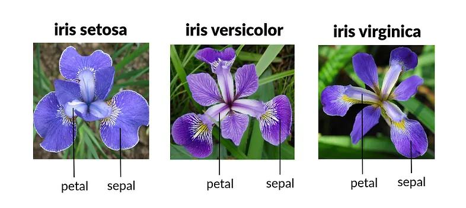
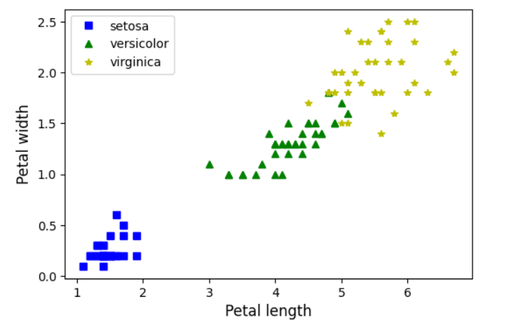

# Iris-Classification-with-SVM

## Dataset:
Attribute Information:
- sepal length in cm
- sepal width in cm
- petal length in cm
- petal width in cm

We use above attributes in dataset to classify data into either 
- Iris-Setosa
- Iris-Versicolour
- Iris-Virginica

## Notebook:
- Import libraries (sklearn (iris dataset), svm model)
- Split dataset (30% for testing)
- Check Petal length and width correlation

- Normalize features (MinMaxScaler)
- Plot dataset to check for classification possibility
- Use SVM to predict from scaled X_train
- Get accuracy score for predictions